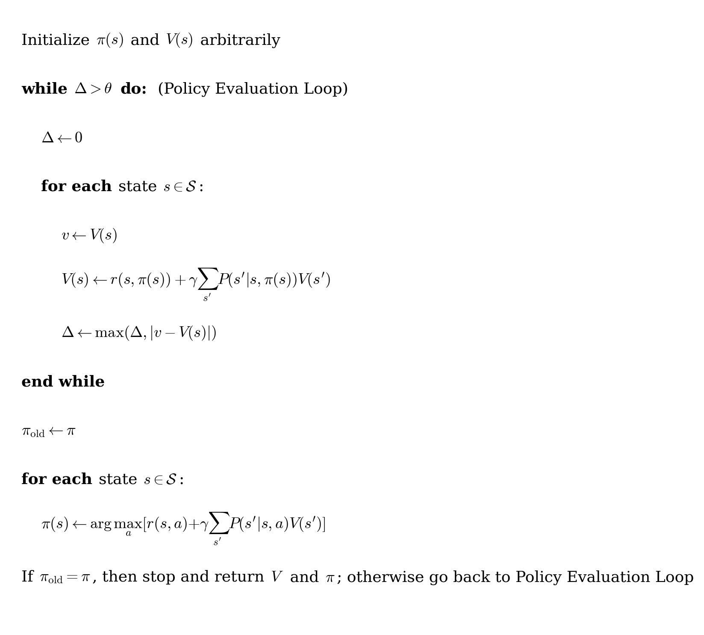

# Homework 4: Reinforcement Learning

- **Due Date: 13.04.26 23:59 CET**  
- **Needs to be solved individually. Plagiarism checks will be performed.**   


### Installation

Use one clean virtual environment for all exercises. The setup was tested on Linux distributions and Windows with Python 3.12. You can also use the Linux computers in CAB H 56 / CAB H 57.

### 1) Create and activate a virtual environment

From the repository root:

**Linux / macOS**
```bash
cd hw4_reinforcement_learning
python3.12 -m venv .venv
source .venv/bin/activate
```

**Windows (PowerShell)**
```powershell
cd hw4_reinforcement_learning
python -m venv .venv
.\.venv\Scripts\Activate.ps1
```

### 2) Install dependencies

```bash
pip install -r requirements.txt
```

### 3) Run smoke tests
**Smoke test A (ex1/ex2 stack: GridWorld + CartPole)**
```bash
python -c "from envs.grid_world import CliffWalkingEnv; from envs.cartpole_wrapper import CartPoleWrapper; g=CliffWalkingEnv(); c=CartPoleWrapper(seed=0); s=c.reset(); ns,r,d,i=c.step(c.sample_action()); c.close(); print('OK ex1/ex2:', g.n_states, s.shape, type(r).__name__)"
```

**Smoke test B (ex3/ex4 stack: MuJoCo + SO100)**
```bash
python -c "from pathlib import Path; import numpy as np; from envs.so100_rl_env import SO100RLEnv; env=SO100RLEnv(xml_path=Path('assets/mujoco/so100_pos_ctrl.xml').resolve(), render_mode=None); obs,_=env.reset(seed=0); obs2,reward,term,trunc,info=env.step(np.zeros(env.action_dim, dtype=np.float32)); env.close(); print('OK ex3/ex4:', obs.shape, float(reward))"
```

If both commands print `OK ...`, the installation is working.

### General Guidelines

- Complete the **TODOs** in the provided code.
- Do **not modify function signatures** unless explicitly stated.
- Use the scripts in the `scripts/` folder to train and test your implementation.
- Results (plots, logs) will be saved in the `logs/` directory.

Keep your code clean and readable. Make sure everything runs before submission.

### Video Guidelines

The purpose of the video is to demonstrate your understanding of the implemented algorithms.

- Keep explanations **clear and concise**
- Focus on **key ideas and results**
- Exceeding the time limit (5 min) may result in a grade penalty.

### Grading

The maximum number of points that can be achieved per exercise:
- **Exercise 1: MDP**: 10 points
- **Exercise 2: DQN**: 10 points
- **Exercise 3: PPO**: 15 points
- **Exercise 4: SAC**: 15 points
- **Video Submission**: 50 points

## Exercise 1: Dynamic Programming in GridWorld

In this exercise, you will implement **policy iteration** and **value iteration** on a tabular MDP using the **Cliff Walking** environment.

### Cliff Walking Environment
The Cliff Walking environment is a 2D gridworld where the agent starts at the bottom-left corner and must reach the goal at the bottom-right while avoiding the cliff. The environment is **stochastic**: when the agent selects an action (up, down, left, right), it is executed as intended with probability `1 - slip_chance` and with probability `slip_chance`, a different action is executed uniformly at random (i.e., the agent may "slip"). Moving beyond the grid boundary leaves the agent in the same state. Each step yields a reward of -1, falling into the cliff gives -100 and terminates the episode, and reaching the goal also ends the episode.

<p align="center">
  
</p>
<p align="center">
  <em>Figure 1-1: Cliff Walking Environment (AI-generated)</em>
</p>

### Algorithms

In this exercise, you will implement two classical dynamic programming algorithms: **Policy Iteration** and **Value Iteration**.

We provide the pseudocode for both algorithms below.

<p align="center">
  
</p>
<p align="center">
  <em>Figure 1-2: Policy Iteration</em>
</p>

<p align="center">
  
</p>
<p align="center">
  <em>Figure 1-3: Value Iteration</em>
</p>

Both methods should converge to the optimal policy.

## TODOs
### Code Implementation
Fill in the TODOs in `exercises/ex1_mdp.py`:

1. **Policy Iteration:** Implement **policy evaluation**, **policy improvement** and **policy iteration loop**.
2. **Value Iteration:** Implement **value iteration update** and **greedy policy extraction**.

For a detailed implementation and explanation of the GridWorld environment, see `envs/grid_world.py`.
After implementing the TODOs, you can test the results of your algorithms by running the following:

```bash
python scripts/run_policy_iteration.py
```

```bash
python scripts/run_value_iteration.py
```

Results will be saved in `logs/mdp/`

You should see **state value** visualization and **optimal policy** visualization.

### Effects of Stochasticity
In this environment, actions may not always be executed as intended due to slipping. To study its effect, run experiments with different values of `slip_chance` by setting the argument `--slip_chance`.

### Theoretical Questions
1. What is the difference between policy iteration and value iteration in terms of their update procedures?
2. What happens if the discount factor `gamma` is close to 0 or 1?
3. How does increasing the slip probability (`slip_chance`) affect the optimal policy? 
   - Compare the cases `slip_chance = 0.0`, `0.01`, and `0.2`.
   - Why does the agent tend to behave more conservatively as stochasticity increases?

### Deliverables
1. **Code:** Your code with filled in TODOs in `exercises/ex1_mdp.py`.
2. **Theoretical questions:** The video must include your answers to the theoretical questions.
3. **Images:** Visualization of the state value function and optimal policy obtained by running `scripts/run_policy_iteration.py` and `scripts/run_value_iteration.py` with `slip_chance` set to `0`, `0.01`, and `0.2`.


## Exercise 2: Deep Q-Network (DQN) on CartPole

In this exercise, you will implement **Deep Q-Network (DQN)** to solve a control problem with **continuous state space**.

### Why DQN?

In previous exercises, we used tabular RL, where a table stores the value of each state-action pair. However, this approach becomes infeasible when the state space is large or continuous.  

To address this, we use **function approximation** to estimate the Q-values. DQN replaces the table with a neural network, allowing us to handle **continuous state spaces with discrete actions**.

### CartPole Environment

The CartPole environment is a classic control problem where a pole is attached to a cart moving along a track. The goal is to keep the pole upright by applying forces to the cart.

<p align="center">
  
</p>
<p align="center">
  <em>Figure 2-1: CartPole Environment</em>
</p>

At each timestep, the agent receives a **4-dimensional continuous state** and selects a **discrete action**.

#### State Space

| Index | Description           | Range            |
| ----- | --------------------- | ---------------- |
| 0     | Cart position         | [-2.4, 2.4]      |
| 1     | Cart velocity         | (-inf, inf)      |
| 2     | Pole angle            | ~[-41.8°, 41.8°] |
| 3     | Pole angular velocity | (-inf, inf)      |

#### Action Space

| Action | Description        |
| ------ | ------------------ |
| 0      | Push cart to left  |
| 1      | Push cart to right |

The agent receives a reward of **+1 at every timestep**. The episode ends when:
- the pole falls beyond a threshold angle,
- the cart moves too far from the center,
- or the maximum episode length is reached.

### DQN Algorithm

DQN extends Q-learning by using a neural network to approximate the Q-function.

Key components of DQN include:

- **Q-learning update:** learning from Bellman equation  
- **Experience Replay:** sampling random mini-batches to break correlation  
- **Target Network:** stabilizing training by using a slowly updated network  

For more details, see the original paper: https://arxiv.org/abs/1312.5602. We provide the pseudocode below.

<p align="center">
  
</p>
<p align="center">
  <em>Figure 2-2: Deep Q-Network (DQN)</em>
</p>

## TODOs

### Code Implementation & Hyperparameter Tuning

Fill in the TODOs in `exercises/ex2_dqn.py` and `exercises/ex2_dqn_config.py`:

1. **Implement DQN:** complete the core components of DQN, including storing transitions in the replay buffer, implementing the Q-network forward pass, selecting actions using an epsilon-greedy policy, and computing the TD target for training.
2. **Hyperparameter Tuning:** tune key hyperparameters (`lr`, `epsilon`, `target_update`, `hidden_dim`) in `exercises/ex2_dqn_config.py` to improve performance. 

### Training

After implementing the TODOs, you can train your agent using:

```bash
python scripts/train_dqn.py
```

Training results (model and curves) will be saved in:

```bash
python logs/dqn
```

### Evaluation

To evaluate your trained model:

```bash
python scripts/eval_dqn.py
```

You can also visualize the learned policy in a GUI window:

```bash
python scripts/eval_dqn.py --play
```

This will open an interactive window where you can directly observe the agent's behavior.

You can optionally record a video of the agent by running:

```bash
python scripts/eval_dqn.py --record_video
```

Note: The options `--play` and `--record_video` cannot be used at the same time, as they require different rendering modes.

### Theoretical Questions
1. Why is experience replay important in DQN?
2. What is the role of the target network in DQN? How does it improve stability?
3. What is Double DQN, and how does it reduce overestimation bias compared to standard DQN? (See: [Deep Reinforcement Learning with Double Q-learning](https://arxiv.org/abs/1509.06461))

### Deliverables
1. **Code:** Your implementation with completed TODOs in `exercises/ex2_dqn.py` and `exercises/ex2_dqn_config.py`.
2. **Results:** The training curve and the printed evaluation summary generated by running the provided scripts. Place all figures in a single PDF file.
3. **Theoretical Questions:** The video must include your answers to the theoretical questions.

## Exercise 3: Proximal Policy Optimization (PPO) on SO100

In this exercise, you will implement PPO for a continuous-control end-effector tracking task with the SO100 robot. We revisit the SO100 MuJoCo environment introduced in Homework 2, now from the RL perspective.

### Introduction

Exercises 1 and 2 focus on low-dimensional toy domains (tabular gridworld and CartPole), which are great for learning core RL ideas but far from real robot control. In Exercises 3 and 4, we move to a MuJoCo-based SO100 tracking task where the policy must output continuous actions (in the joint space) and handle richer dynamics.

The structure is intentionally shared between PPO (on-policy) and SAC (off-policy). You will compare the two major RL paradigms under the same environment, reward structure, and evaluation protocol. The goal is not only to implement each algorithm, but also to understand the stability-sample-efficiency tradeoff in continuous control.

We recommend you read the two selected papers on the topic before starting the implementation. Our proposed implementation has slight deviations from the papers. You can find the pseudocode of the implementation we used in our own solution below.

### State Space

The observation is a 19-dimensional vector constructed in the robot base frame:

| Index | Dimension | Description                                  |
| ----- | --------- | -------------------------------------------- |
| 0–5   | 6         | Joint positions (`qpos`)                     |
| 6–8   | 3         | End-effector position (base frame)           |
| 9–12  | 4         | End-effector orientation quaternion (base frame) |
| 13–15 | 3         | Target position (base frame)                 |
| 16–18 | 3         | Position error: target − end-effector (base frame) |

### Action Space

The policy outputs a **6-dimensional continuous action** in \([-1, 1]^6\). Each component is linearly mapped to the corresponding joint's physical position range via `process_action`.

### Joint Space

The SO100 arm has 6 revolute joints (position-controlled):

| Index | Joint Name   | Axis  | Range (rad)         |
| ----- | ------------ | ----- | ------------------- |
| 0     | Rotation     | Y     | [−1.92, 1.92]       |
| 1     | Pitch        | X     | [−3.32, 0.174]      |
| 2     | Elbow        | X     | [−0.174, 3.14]      |
| 3     | Wrist_Pitch  | X     | [−1.66, 1.66]       |
| 4     | Wrist_Roll   | Y     | [−2.79, 2.79]       |
| 5     | Jaw          | Z     | [−0.174, 1.75]      |

### Suggested Reading

- PPO paper: https://arxiv.org/abs/1707.06347
- Generalized Advantage Estimation (used in PPO): https://arxiv.org/abs/1506.02438

<!-- ### Implementation Pseudocode (This Homework)

<p align="center">
  
</p>
<p align="center">
  <em>Figure 3-1: PPO (Actor-Critic, this homework)</em>
</p> -->

## TODOs

### Code Implementation

Fill in the TODOs in `exercises/ex3_ppo_student.py`:

1. **Action/value/log-prob computation:** implement policy action sampling, action clipping, log-probability retrieval, and action mean and std retrieval in `select_action`.
2. **KL divergence:** compute KL divergence between the old and new Gaussian policy distributions in `compute_kl_mean`.
3. **Surrogate loss:** implement PPO surrogate loss terms in `compute_surrogate_loss`.
4. **Value loss:** implement PPO value loss in `compute_value_loss`.
5. **Entropy loss:** implement PPO entropy loss in `compute_entropy_loss`.
6. **Optimization steps:** complete one step of actor and critic update loops in `update`.

### Training

After implementing the TODOs, you can train your agent using:

```bash
python scripts/train_ppo.py
```

Training artifacts are saved to:

- `logs/ppo/YY_MM_DD_HH_MM_SS_model` (checkpoints and tensorboard event log)

Training curves are saved in Tensorboard. Run the following command to view them:

```bash
tensorboard --logdir="your tensorboard event file path"
```

### Evaluation

To evaluate your trained model:

```bash
python scripts/eval_ppo.py
```

To run policy playback in a GUI window:

```bash
python scripts/eval_ppo.py --play
```

On macOS, if MuJoCo/OpenGL rendering issues occur, run evaluation with:

```bash
.venv/bin/mjpython scripts/eval_ppo.py --play
```

Evaluation summary is printed on terminal screen. An example is shown below:

```
===== Evaluation Summary =====
Number of episodes   : 20
Mean return          : 60.058
Std return           : 12.936
Min return           : 21.256
Max return           : 69.988
Median return        : 65.168
Mean length          : 30.00
Std length           : 0.00
Mean tracking error  : 0.015097
Std tracking error   : 0.015067
Min tracking error   : 0.003123
Max tracking error   : 0.064921
```


### Theoretical Questions
1. Why does PPO clip the probability ratio instead of directly constraining the KL divergence like TRPO? What goes wrong if you remove clipping entirely?
2. PPO throws away all collected data after each update. Why can't you simply reuse old rollouts for more gradient steps?
3. What does the GAE parameter \(\lambda\) control? What happens at the extremes \(\lambda = 0\) and \(\lambda = 1\)?

### Deliverables
1. **Code:** Your implementation with completed TODOs in `exercises/ex3_ppo_student.py`.
2. **Results:** All training curves from tensorboard and the printed evaluation summary generated by running the provided scripts. Place all figures in a single PDF file.
3. **Theoretical Questions:** The video must include your answers to the theoretical questions.


## Exercise 4: Soft Actor-Critic (SAC) on SO100

In this exercise, you will implement SAC for the same continuous-control SO100 tracking task.
As in Exercise 3, this revisits the SO100 MuJoCo environment from Homework 2.

### Suggested Reading

- SAC paper: https://arxiv.org/abs/1812.05905

<!-- ### Implementation Pseudocode (This Homework)

<p align="center">
  
</p>
<p align="center">
  <em>Figure 4-1: SAC (this homework)</em>
</p> -->

### Adjustments vs. the SAC Paper

Our implementation follows the core SAC algorithm (Haarnoja et al., 2018) but adds two features.

1. **Automatic temperature tuning** is included by default.

2. Our implementation uses **uniform random actions** for the first `start_steps = 1000` environment steps to populate the replay buffer with diverse initial data before learning begins.

## TODOs

### Code Implementation

Fill in the TODOs in `exercises/ex4_sac_student.py`:

1. **Policy action sampling:** implement action sample in `select_action`.
2. **Critic loss:** implement SAC Bellman target and critic loss in `compute_critic_loss`.
3. **Actor loss:** implement actor objective in `compute_actor_loss`.
4. **Entropy loss:** implement alpha loss in `compute_actor_loss`.
5. **Target updates:** implement soft target-network updates in `soft_update_targets`.
6. **Optimization steps:** complete one step of actor, critic, and alpha update loops in `update`.

### Training

After implementing the TODOs, you can train your agent using:

```bash
python scripts/train_sac.py
```

Training artifacts are saved to:

- `logs/sac/YY_MM_DD_HH_MM_SS_model` (checkpoints and tensorboard event log)

Training curves are saved in Tensorboard. Run the following command to view them:

```bash
tensorboard --logdir="your tensorboard event file path"
```

### Evaluation

To evaluate your trained model:

```bash
python scripts/eval_sac.py
```

To run policy playback in a GUI window:

```bash
python scripts/eval_sac.py --play
```

Same as in ex3, evaluation summary is printed on terminal screen.

### Theoretical Questions
1. SAC adds an entropy bonus to the reward. What are the benefits of this?
2. SAC squashes actions through tanh. Why does this require a log-probability correction?
3. The temperature \(\alpha\) is tuned automatically. What happens when the policy's entropy is above vs. below the target?
4. How does SAC compare with PPO in terms of update-to-data (UTD) ratio? (UTD = gradient update steps / environment steps)
5. Briefly discuss about the advantages and disadvantages of on-policy vs. off-policy algorithms.


### Deliverables
1. **Code:** Your implementation with completed TODOs in `exercises/ex4_sac_student.py`.
2. **Results:** All training curves from tensorboard and the printed evaluation summary generated by running the provided scripts. Place all figures in a single PDF file.
3. **Theoretical Questions:** The video must include your answers to the theoretical questions.

## Submission

### Code Submission

Submit the following files to the **Homework 4** assignment on Gradescope:

- `exercises/ex1_mdp_student.py`
- `exercises/ex2_dqn_student.py`
- `exercises/ex2_dqn_config.py`
- `exercises/ex3_ppo_student.py`
- `exercises/ex4_sac_student.py`

Do **not** rename any files or modify function signatures. The autograder will verify your implementation upon upload.

### Video Submission

Submit a single video file (`.mp4`) covering all exercises. If the file is too large for submission, you can split them into multiple files, but clearly indicate their order.

- **Maximum duration: 5 minutes.** Exceeding the time limit will result in a grade deduction. No speedup (e.g. 1.5x, 2x playback) is allowed.
- As a rough guideline, aim for approximately 1 minute per exercise 1-3, and 2 minutes for exercise 4.
- You may use slides, plots, or screen recordings to support your explanations.
- Results must be **visible on screen** while you are explaining them.
- Before submitting check the video and audio. 


